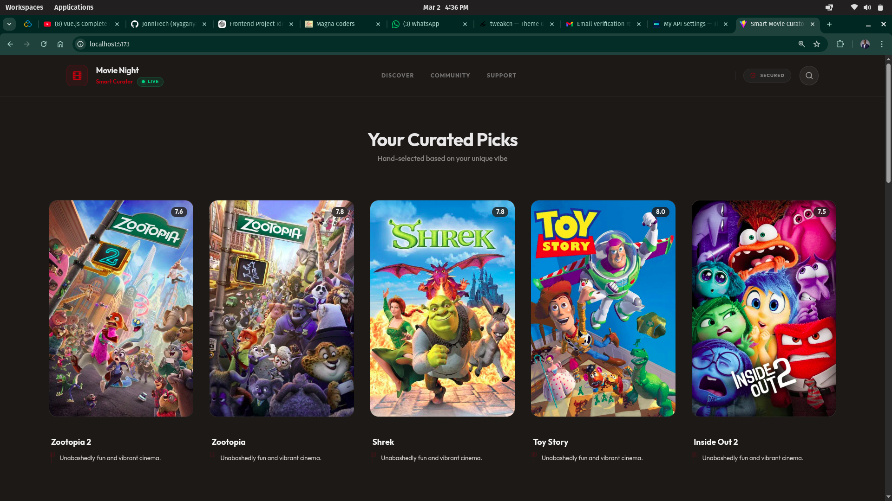
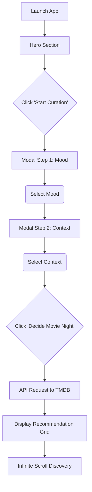
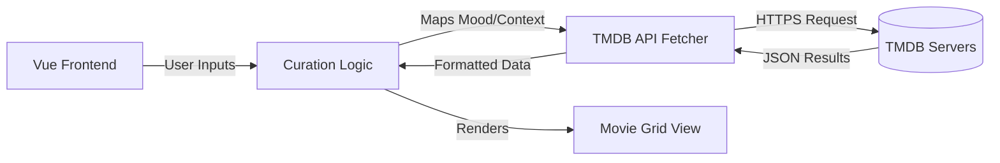

# Smart Movie Curator

<div align="center">
  
</div>

<br />
<div style="height: 2px; width: 100%; background: linear-gradient(90deg, transparent, #b91c1c, transparent); animation: pulse 2s infinite;"></div>
<br />

## Aim
The primary aim of this project is to eliminate the common friction and indecision associated with selecting a movie for a specific social setting or mood. By leveraging a high-fidelity cinematic intelligence engine, the application provides curated, highly relevant movie recommendations quickly and elegantly.

<br />
<div style="height: 2px; width: 100%; background: linear-gradient(90deg, transparent, #b91c1c, transparent); animation: pulse 2s infinite;"></div>
<br />

## Problem
Viewers frequently spend an excessive amount of time scrolling through vast streaming libraries without making a choice. This phenomenon, often called "decision fatigue" or "analysis paralysis," occurs because generic movie lists do not account for the immediate emotional state (mood) or the specific social environment (solo, friends, partner) of the user. The sheer volume of choices becomes a barrier rather than a benefit.

<br />
<div style="height: 2px; width: 100%; background: linear-gradient(90deg, transparent, #b91c1c, transparent); animation: pulse 2s infinite;"></div>
<br />

## Solution
This application solves the problem by transforming the movie selection process into a guided, two-step curation flow:
1. **Mood Selection:** Capturing the user's current emotional state via a specialized interface.
2. **Context Selection:** Defining the social environment to refine genre weightings.

The system maps these inputs to specific cinematic genres and constraints, interfacing with the TMDB API to pull highly rated, relevant titles. The interface is deliberately designed with a premium, focused, and distraction-free aesthetic to streamline the path to visualization.

<br />
<div style="height: 2px; width: 100%; background: linear-gradient(90deg, transparent, #b91c1c, transparent); animation: pulse 2s infinite;"></div>
<br />

## Key Features
* **Sequential Modal Flow:** A distraction-free, multi-step process for input gathering.
* **Cinematic Intelligence Engine:** Advanced mapping of moods to complex genre combinations.
* **Infinite Discovery Grid:** Continuous exploration of recommendations through seamless infinite scroll.
* **Premium SaaS Aesthetics:** High-fidelity UI with glassmorphism, pulse animations, and spring-based transitions.
* **Mobile First Design:** Fully responsive interface optimized for all screen sizes and touch interactions.
* **Live Status Integration:** Real-time system monitoring and connectivity indicators.

<br />
<div style="height: 2px; width: 100%; background: linear-gradient(90deg, transparent, #b91c1c, transparent); animation: pulse 2s infinite;"></div>
<br />

## Tech Stack
The project is built with a state-of-the-art web stack for maximum performance and visual excellence:


<br />
<div style="height: 2px; width: 100%; background: linear-gradient(90deg, transparent, #b91c1c, transparent); animation: pulse 2s infinite;"></div>
<br />

## Project Structure
The code follows a clean, modular architecture:

```text
src/
├── assets/             # Global images and static resources
├── components/         # Reusable UI components
│   ├── ui/             # Primitive shadcn-based components
│   ├── HeaderBar.vue   # Persistent navigation and status
│   ├── MoodSelector.vue# Mood input interface
│   └── MovieCard.vue   # Cinematic movie card display
├── lib/                # Core logic and utilities
│   ├── api.ts          # TMDB API integration and curation engine
│   └── utils.ts        # Tailwind merge and common helpers
├── App.vue             # Main layout and modal state management
└── main.ts             # Application entry point
```

<br />
<div style="height: 2px; width: 100%; background: linear-gradient(90deg, transparent, #b91c1c, transparent); animation: pulse 2s infinite;"></div>
<br />

## Flow Diagrams

### Curation Flow


### Architecture Flow


<br />
<div style="height: 2px; width: 100%; background: linear-gradient(90deg, transparent, #b91c1c, transparent); animation: pulse 2s infinite;"></div>
<br />

## Configuration and Getting Started

### Environment Variables
The application requires a valid TMDB API Read Access Token to function. Create a `.env` file in the root directory:

```bash
VITE_TMDB_API_KEY=your_tmdb_api_key_here
```

### Installation
1. Clone the repository
2. Install dependencies: `npm install`
3. Start the development server: `npm run dev`
4. Build for production: `npm run build`

<br />
<div style="height: 2px; width: 100%; background: linear-gradient(90deg, transparent, #b91c1c, transparent); animation: pulse 2s infinite;"></div>
<br />

## Performance and Optimization
* **Lazy Loading:** All movie posters use native lazy loading to preserve bandwidth.
* **Component-Level Code Splitting:** Ensuring fast initial paint times.
* **Global State Caching:** Minimizing redundant API calls during session discovery.
* **Hardware Accelerated Animations:** Leveraging CSS transforms for smooth 60fps interactions.

<br />
<div style="height: 2px; width: 100%; background: linear-gradient(90deg, transparent, #b91c1c, transparent); animation: pulse 2s infinite;"></div>
<br />

## Developer Information
**Movie Night Curator • Professional Edition**  
Programmed by NYAGANYA.

*Disclaimer: This product uses the TMDB API but is not endorsed or certified by TMDB.*
